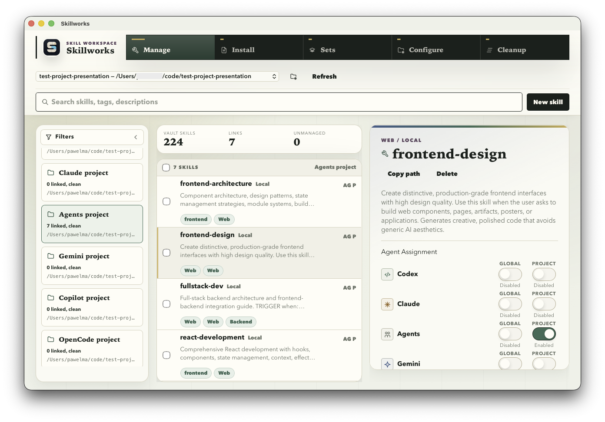
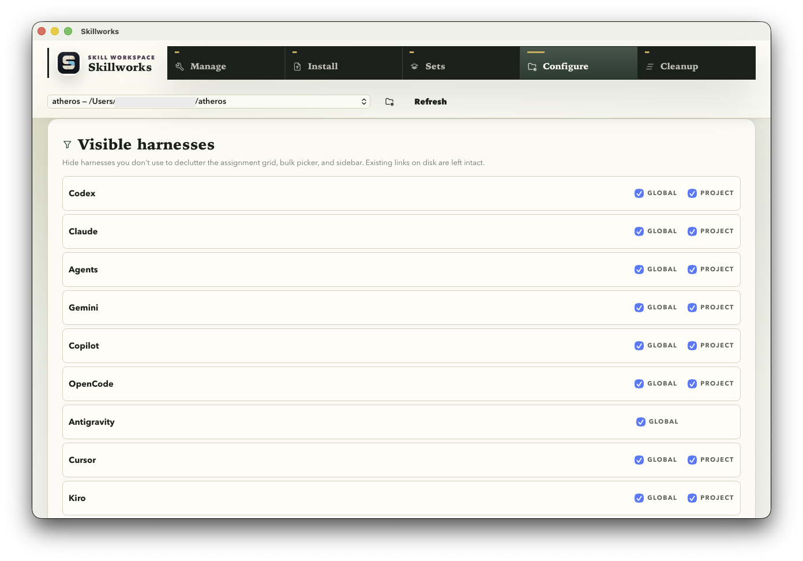
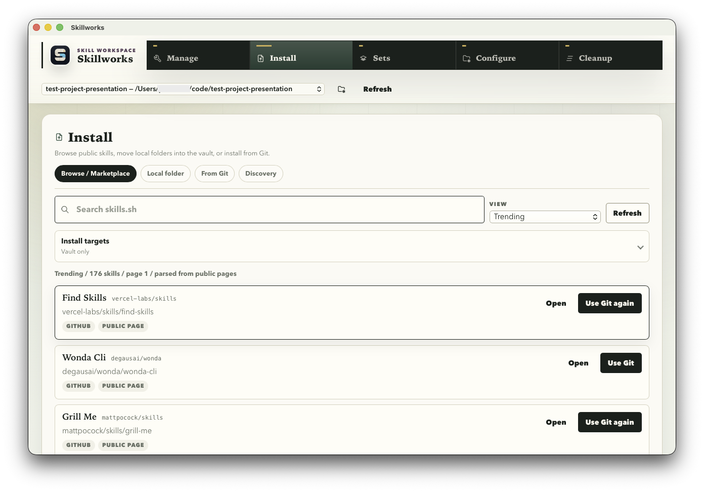
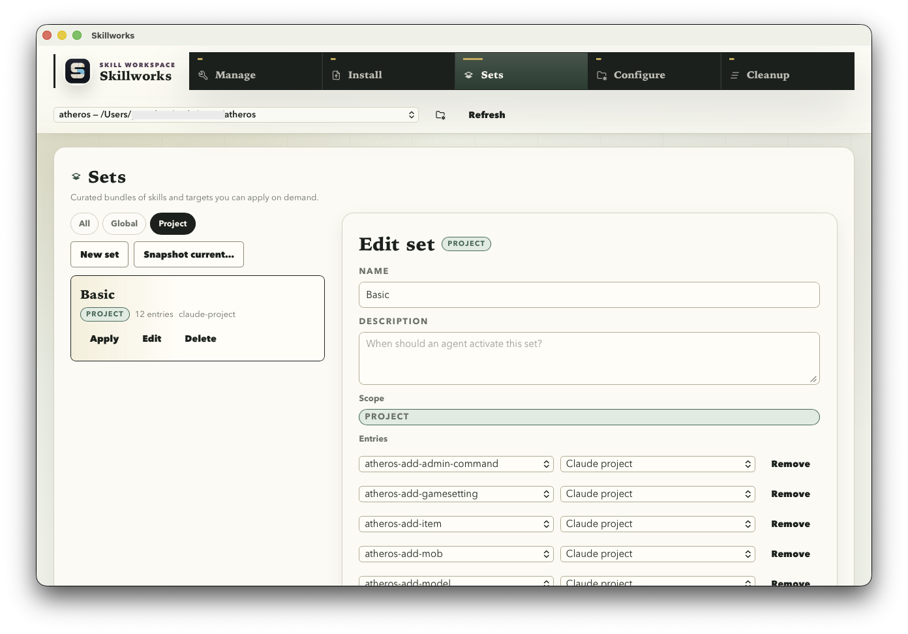

<h1 align="center">Skillworks</h1>

<p align="center">
  
</p>

<p align="center">
  A local, project-aware skill workspace for coding agents (Claude Code, Codex, Cursor, Gemini CLI, OpenCode, and more).
</p>

<p align="center">
  
</p>

Skillworks keeps the canonical skill library in a hidden home-directory **vault** and activates skills by symlinking them into agent-specific global or project directories. The desktop app handles browsing, importing, installing from Git, switching between named sets, and discovering new skills from [skills.sh](https://skills.sh).

## Architecture

Skillworks is a Tauri 2 desktop app with a **native Rust backend** (`src-tauri/src/backend/`) and a Vite + React + plain-CSS frontend. The frontend invokes Rust commands directly over IPC — there is no Node sidecar, no HTTP server, and no localhost port to manage.

The only remaining Node component is `src/mcp-server.js`, an optional **MCP stdio server** used for agent-driven set activation. It runs as a separate process and shares the vault, config, and per-skill manifest files on disk with the desktop app.

## Install & Run

Prerequisites: Node.js 20+, Rust stable, and the Tauri build dependencies for your OS (see `docs/tauri-build.md`).

```bash
npm install
```

Desktop dev shell:

```bash
npm run desktop:dev
```

Production desktop build (writes `.app`/`.dmg`/`.msi`/`.deb`/`.AppImage` under `src-tauri/target/release/bundle/`):

```bash
npm run desktop:build
```

MCP stdio server (optional, for agent-driven set activation):

```bash
npm run mcp
```

For the signed-and-notarized release workflow, see `RELEASING.md`.

## Storage

Default app state lives in:

```text
~/.skillworks/config.json
~/.skillworks/vault/
```

For installs upgraded from earlier versions, Skillworks will fall back to `~/.agent-skill-manager/` if `~/.skillworks/` does not exist. Existing `.agent-skill-manager.json` manifests inside individual skill directories and project-local set files (`<project>/.agent-skill-manager/sets.json`) are read in place.

Overrides:

```bash
SKILLWORKS_HOME=/path/to/app-home
SKILLWORKS_VAULT=/path/to/vault
```

Both env vars are honored by the desktop app and the MCP server.

## Targets

A **target** is a directory where an agent looks for skills. Each global target lives under `$HOME`; project targets live under a specific project root.

Built-in global targets:

```text
~/.codex/skills           ~/.claude/skills          ~/.agents/skills
~/.gemini/skills          ~/.copilot/skills         ~/.config/opencode/skills
~/.gemini/antigravity/skills
~/.cursor/skills          ~/.kiro/skills            ~/.codebuddy/skills
~/.openclaw/skills        ~/.trae/skills            ~/.qoder/skills
```

Built-in project targets (under each project root):

```text
.codex/skills    .claude/skills    .agents/skills    .gemini/skills
.copilot/skills  .opencode/skills  .cursor/skills    .kiro/skills
.codebuddy/skills .openclaw/skills .trae/skills      .qoder/skills
```

Custom targets (extra paths the user wants to manage) are persisted in the config and shown alongside the built-ins.

Disabling a skill on a target only removes symlinks that point back to the vault; unmanaged real directories at the same path are left alone.

## Importing Existing Skills

Use the **Import** panel with a folder that either is a skill directory (contains `SKILL.md`) or contains skill directories.

Importing **moves** skills into the vault — the source directory is removed from its original location and any existing symlinks in known global/project targets that pointed at that source are unlinked. This keeps imported skills disabled until Skillworks explicitly links them back.

Symlinked skills are importable too. When a target contains a symlink to a skill directory, the manager moves the real target into the vault and removes the old symlink.

If the vault already contains an identical `SKILL.md`, import deduplicates by removing the old source and keeping the existing vault copy.

Use **Move suggested** to process every suggested global/project skill path in one batch. Missing paths are skipped, duplicate path entries are ignored, and the same move/dedupe rules apply to each found skill.

## Multi-Source Discovery

The Install tab automatically scans:

```text
Global skill directories
Project skill directories
Plugin cache directories
Single-file instruction configs
The Skillworks vault
```

Global and project skill folders are considered safe `Move suggested` sources. Plugin caches and single-file configs are shown for visibility but are scan-only, because moving plugin-owned cache files can break the owning plugin installation.

## Configure tab

<p align="center">
  
</p>

The Configure tab is where you set the vault root, add custom targets, hide unused harness targets, and manage the project list.

### Project Management

The Configure tab has a Projects panel for:

- Adding a project manually
- Loading saved projects
- Scanning a chosen workspace folder for projects with skill directories
- Running a narrower workspace scan across common dev folders

Saved projects are persisted in `~/.skillworks/config.json` and mirrored into the WebView's `localStorage`, so the project list is restored on next launch without re-running the scan. Scanned entries can be cleared separately from manually-added projects.

The scanner discovers project roots that contain any of:

```text
skills/**/SKILL.md
.agents/skills/**/SKILL.md
.codex/skills/**/SKILL.md
.claude/skills/**/SKILL.md
```

It skips global harness folders, plugin caches, hidden dotfolder project roots, the Skillworks vault, and heavyweight directories such as `.git`, `node_modules`, build outputs, and OS cache/library folders. Scanned project roots must also look like real projects by containing a common marker such as `.git`, `package.json`, `pyproject.toml`, `Cargo.toml`, `go.mod`, `Package.swift`, or similar.

## Install tab

<p align="center">
  
</p>

The Install tab has two sub-tabs — **From Git** and **Browse** — for adding skills to the vault.

### From Git

The From-Git form clones a Git repository, discovers every `SKILL.md` under it, moves those skills into the vault, and optionally links them to selected targets.

Supported source forms:

```text
https://github.com/org/repo.git
https://github.com/org/repo.git#branch-or-tag
https://github.com/org/repo.git#branch-or-tag:path/inside/repo
```

HTTPS clones are supported out of the box (libgit2 is bundled with vendored OpenSSL — no system git or TLS stack required).

You can target any combination of the built-in global/project targets, custom targets, or vault-only.

### Browse the Marketplace

The Browse sub-tab connects to [skills.sh](https://skills.sh) for discovery.

- **Trending / Hot / All-time / Official** views pull the public listings.
- **Search** queries hit the skills.sh sitemap (~10k skill URLs) when the auth-walled JSON API is unavailable, giving effective full-catalog search without an API key.
- The **Open** button on a card launches the skill's skills.sh page in your default browser (URLs are scope-allowlisted to `skills.sh` and `github.com`).
- **Install** populates the From-Git form with the upstream repo so you can choose which targets to link it to before committing.

If you have a skills.sh API key, set `SKILLS_SH_API_KEY` before launching the app for richer JSON responses and search.

## Bulk Actions

Select skills in the matrix with the left checkbox column. Bulk actions support:

```text
Enable / Disable / Toggle selected skills on a chosen target
Copy selected vault skills to a destination folder
Move selected vault skills to a destination folder
Delete selected vault skills
```

The skill details pane also has a **Delete** button for one-off removals (with a confirmation dialog).

Move and delete remove managed symlinks first. Delete requires UI confirmation before the command is invoked.

## Sets

<p align="center">
  
</p>

Sets are saveable, switchable collections of `(skill, target)` pairs. Each set has a description so agents can choose the right set before activating it.

Scopes:

- **Global** — stored in `~/.skillworks/config.json` and shared across projects.
- **Project** — stored in `<project>/.agent-skill-manager/sets.json` and travel with the project.

**Apply** replaces state only in the targets the set references; targets the set doesn't mention are left alone. Skills missing from the vault are skipped with a warning rather than blocking the apply.

The Sets tab supports creating, editing, snapshotting the current state, and applying. Each project in the Manage tab can pin multiple sets and apply any of them with one click.

## MCP Server (agent-driven activation)

`src/mcp-server.js` is a small Node MCP stdio server that exposes tools for listing and activating sets. It shares state on disk with the desktop app — both can run concurrently and see each other's changes after a refresh.

Direct invocation:

```bash
node src/mcp-server.js --project /path/to/project --app-home ~/.skillworks
```

When installed from npm, it can run through `npx`:

```bash
npx -y skillworks --project-from-cwd
```

Project resolution order:

1. `--project-from-cwd`
2. `--project /path/to/project`
3. `SKILLWORKS_PROJECT`
4. `AGENT_SKILL_PROJECT`
5. `CLAUDE_PROJECT_DIR`
6. the process cwd

### Claude Code MCP

Add it from the root of a project you want Claude Code to work on:

```bash
claude mcp add --transport stdio skillworks -- npx -y skillworks --project-from-cwd
```

For a project-scoped config checked into `.mcp.json`:

```bash
claude mcp add --transport stdio --scope project skillworks -- npx -y skillworks --project-from-cwd
```

After adding it, restart Claude Code or run `/mcp` inside Claude Code to confirm the server connected.

## Compatibility

Skillworks still reads the legacy `AGENT_SKILL_*` environment variables and reuses existing `.agent-skill-manager` manifests and project set files, so installs upgraded from older versions keep working without migration.

## Test

```bash
npm test                                                    # Node side (MCP server + sets module)
PATH="$HOME/.rustup/toolchains/$(rustc -vV | sed -n 's|host: ||p')/bin:$PATH" \
  cargo test --manifest-path src-tauri/Cargo.toml --lib     # Rust side (desktop backend)
```
